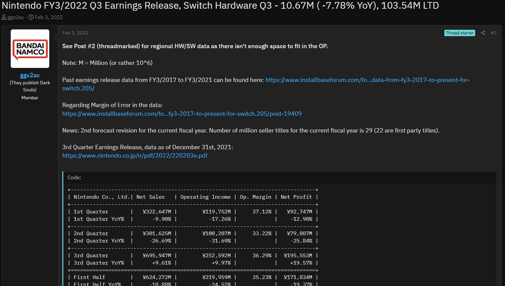

# nintendo-earnings-data-python

I am Github user r134x7 also known as ggx2ac in some places. This repository constains code for outputting Nintendo's financial earnings 
data in code format. The code is written in Python.

Background History:

I regularly make threads on video game forums for reporting Nintendo's financial earnings results that are reported quarterly.
It gets very competitive posting threads on some forums because if you're not quick to post the thread first then someone else
will be first and any duplicate threads will be locked. That was when I wanted to improve the quality of my threads that my work could 
stand out, first I went to learn the terms used for financial years because one common occurence was that thread titles did not contain
the financial year for the quarter being reported. There would also be confusion when someone writes FY18 for example but that does not 
tell you when a company's financial year ends because it could refer to a fiscal year starting or ending in 2018. That's when I started
posting the threads giving the month that a company's financial year ends for example, Nintendo FY3/2022 refers to Nintendo's financial
year ending in March 2022 (All companies have financial years ending in different months). So when you think of a calendar year the calendar year for 2022 ends on 12/2022 and then the following month is the beginning of the calendar year ending in 12/2023. When I started doing this the effect was immediately obvious as other thread makers also tried putting in financial years in their thread titles 
for other video game companies although they didn't the exact syntax, instead they were putting the financial year in a range showing the beginning and end but not mention any month the fiancial year ends. It became obvious they wanted to do what I did but they didn't understand the syntax and they didn't want to make it look like they were copying me even though they could've asked me for help.

So around 2018 was when I felt the next step to improving my threads on Nintendo's earnings results was by using code to display the data. I was inspired by Chris1964 who posts Media Create sales threads weekly because the hardware data for Japan would be put in code output arranged in a table for ease of readability. I didn't ask for any help from him because I have had prior experience with programming from my University days. I taught myself how to code in Java from free online resources, I then bought an Android app that was a Java IDE. This is because I didn't have a computer so all the code was done on a smartphone using two thumbs. So from 2018 to 2021 I coded in Java to display Nintendo's financial data which would increase in size due to what gets reported. It's not just money that gets reported but sales data regarding units sold for Nintendo's hardware and software.

At the second half of 2021 the Java IDE app I was using no longer worked properly so I ended up finding a Python IDE Android app and started learning how to code in Python. It was a huge improvement because it reduced the amount of lines I used but it also let me tackle adding in new data. For those unaware, the data I post isn't a simple copy and paste. There is data in there in there you wouldn't find from what Nintendo posts such as quarterly data (not cumulative) and year-on-year data for hardware/software.

Link to repository: [https://github.com/r134x7/nintendo-earnings-data-python](https://github.com/r134x7/nintendo-earnings-data-python)

This is only a screenshot of the code output on the forum Install Base: 
